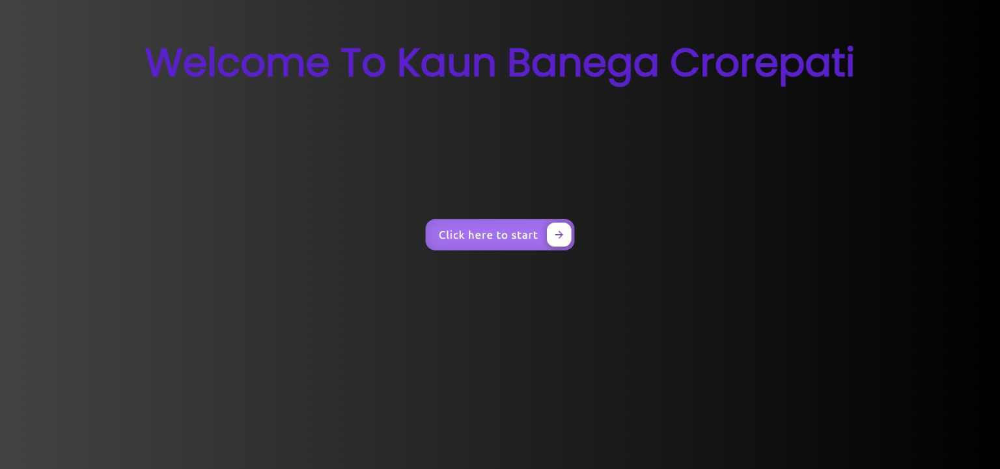

<h1 align="center">Crework Hackathon Project - 02</h1>
<h1 align="center">KBC-Game</h1>

### Kaun Banega Crorepati (also simply known as KBC) is an Indian Hindi-language television game show. It is the official Hindi adaptation of the Who Wants to Be a Millionaire?

## Screenshots:

### Loading-Screen:

### Main-Screen:

## Features:

- Random questions every time.(using API)
- Minimal and Lightweight User Interface
- Easy to use and basic functionality.
-  Users can quit from game anytime.

## Built With:

- HTML5
- CSS3
- JavaScript
